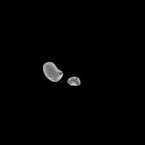
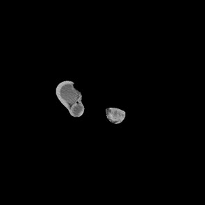
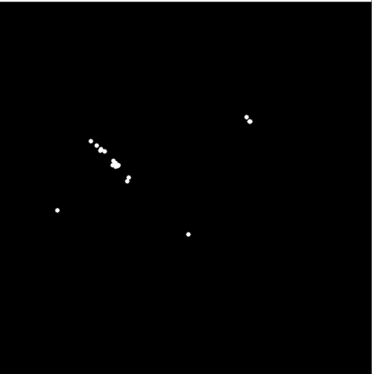
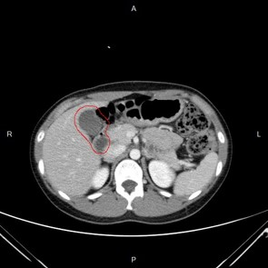
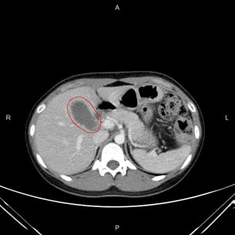

# 急性膽囊炎 CT 影像辨識系統

本專案建立一套結合**深度學習模型**與**影像處理技術**的自動化 CT 影像分析系統，能夠快速且準確地辨識腹部 CT 影像中的膽囊位置與輪廓，並進一步判斷是否為**急性膽囊炎（Acute Cholecystitis, AC）**。此系統可大幅減少醫師人工檢視時間，並提供影像輔助資訊作為診斷與手術治療的參考。

---

## 專案架構與模型

| 模型名稱        | 說明 |
|----------------|------|
| **GB_Model**   | 使用 VGG16 架構辨識影像中是否存在膽囊器官。 |
| **Segment_Model** | 採用 U-Net 架構，結合影像膨脹與雙邊濾波等前處理，進行膽囊的語意分割，輸出輪廓與大小資訊。 |
| **AC_Model**   | 使用 VGG16 架構進行急性膽囊炎的辨識，輸出高風險區域與預測機率。 |

---

## 系統功能

執行 `windows.ipynb` 可進行完整的急性膽囊炎判別流程：

1. 選擇一組腹部 CT 影像。
2. 系統會進行以下流程：
   - 是否包含膽囊（GB_Model）
   - 膽囊分割與輪廓標註（Segment_Model）
   - 急性膽囊炎機率預測與可視化（AC_Model）
3. 輸出包含分割結果與高風險影像的報告。

 範例展示影片：`example.mp4`

---
## 分割影像後處理方法

在 CT 影像經過模型分割後，可能會誤分出與膽囊外觀相似的其他器官（如下圖所示）。為了準確保留正確的膽囊區域，本系統設計了一套結合**連續影像分析**與**影像處理技術**的過濾演算法。

|  |  |

---

### 處理流程

1. **影像疊加與輪廓比對**  
   疊加第 N 張與第 N+1 張的分割影像，找出重疊輪廓區域，並將輪廓標註於第 N 張影像上。

2. **輪廓質心計算與洪水填充法（Flood Fill）**  
   針對每個輪廓計算質心作為種子點，使用洪水填充法保留連續區域並濾除雜訊區塊。

   

   

   

3. **質心點紀錄與視覺化分析**  
   記錄每張影像上所有分割輪廓的質心，並以圖表方式呈現其空間分布情形：

   | 影像編號 | 質心點                          |
   |----------|-----------------------------------|
   | 1        | (160,226)                         |
   | 2        | (156,224)                         |
   | 3        | (163,225), (350,158)              |
   | 4        | (164,224), (344,164)              |
   | 5        | (160,221), (345,163)              |
   | 6        | (159,221)                         |
   | 7        | (80,286), (157,218)               |
   | 8        | (130,204)                         |
   | 9        | (145,205)                         |
   | 10       | (140,202)                         |

   

   

   

4. **質心群組化篩選**  
   以影像編號中段為基準，向前後延伸一定距離的質心點形成群組，並選出出現頻率最高的群組視為**膽囊輪廓群組**。

   範例結果群組質心點如下：  
   `(160,226), (156,224), (163,225), (164,224), (160,221), (159,221), (157,218), (130,204), (145,205), (140,202)`

5. **回推原始輪廓，取得膽囊區域**  
   根據篩選出的質心群回推其對應輪廓區塊，過濾掉非膽囊區域，完成最終的膽囊輪廓篩選。

   

   |  |  |

   

---

## 軟體與環境版本

| 套件 | 版本 |
|------|------|
| Python | 3.7.16 |
| TensorFlow (GPU) | 2.0.0 |
| NumPy | 1.21.6 |
| OpenCV | 4.6.0 |
